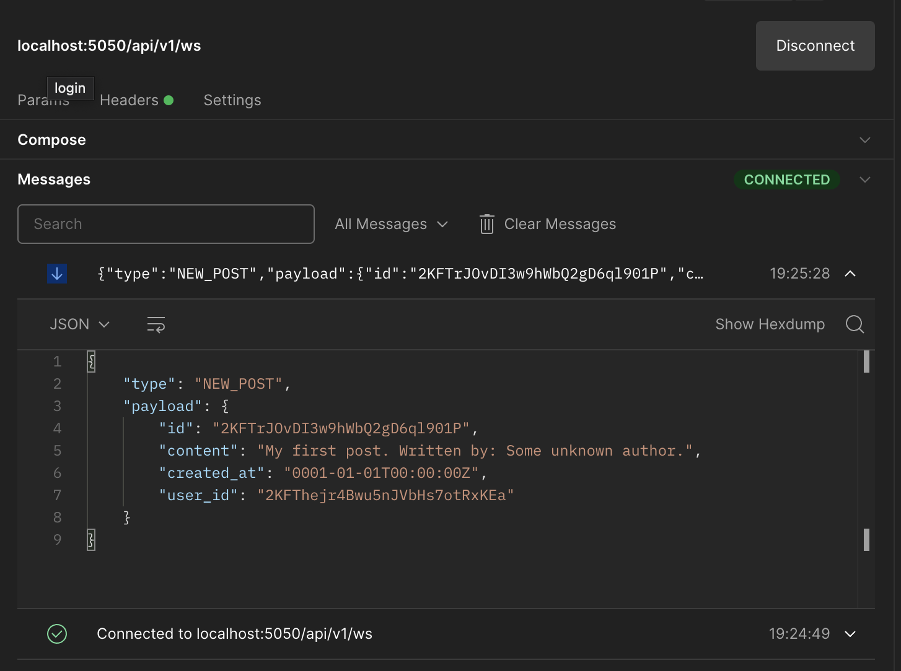

# Web forum with REST and WebSockets

This project consists of an API for a simple web forum that allows users to
create, update, delete and list posts. Users can create an account and
login within the site. In addition, they can open a websocket connection to
get notified of any new posts. Finally, users can see their own information.

The project consists on a service that is facing user's request. The data is backed
up in a Postgres DB, the authentication system uses JSON web tokens, and HTTP and websocket protocols are used.

## Instructions

To run this proyect in your local environment:

- Go to the root of the proyect and then

```console
    docker-compose up -d --build
```

Locally:

- To sing up:

  [POST] localhost:5050/api/v1/signup

  ```json
  {
    "email": "your@email.com",
    "password": "yourpassword"
  }
  ```

- To login and get a token:

  [POST] localhost:5050/api/v1/login

  ```json
  {
    "email": "your@email.com",
    "password": "yourpassword"
  }
  ```

- To open a websocket connection:

  

  localhost:5050/api/v1/ws

  Header

  ```json
  {
    "Authorization": "the.received.token"
  }
  ```

- To Get user info:

  

  [GET] localhost:5050/api/v1/me

  Header

  ```json
  {
    "Authorization": "the.received.token"
  }
  ```

- To create a new post:

  

  [POST] localhost:5050/api/v1/posts

  Header

  ```json
  {
    "Authorization": "the.received.token"
  }
  ```

  Body

  ```json
  {
    "content": "The post content"
  }
  ```

- To get a post:

  

  [GET] localhost:5050/api/v1/posts/{post_id}

  Header

  ```json
  {
    "Authorization": "the.received.token"
  }
  ```

- To update the content of a post:

  

  [PATCH] localhost:5050/api/v1/posts/{post_id}

  Header

  ```json
  {
    "Authorization": "the.received.token"
  }
  ```

  Body

  ```json
  {
    "content": "The new post content"
  }
  ```

- To delete a post:

  

  [DELETE] localhost:5050/api/v1/posts/{post_id}

  Header

  ```json
  {
    "Authorization": "the.received.token"
  }
  ```
